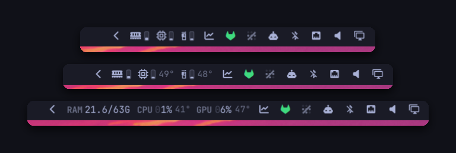

# Hardware Monitor — Omarchy bar widget

Memory, CPU, and GPU in the bar. Three readouts, cycled with a right click:
gauges alone, gauges with temperatures, or the numbers spelled out.



Everything is read straight from `/proc` and `/sys` inside the shell process —
no polling script, no subprocess on a timer.

## Install

```sh
omarchy plugin add https://github.com/edgarsilva/omarchy-hw-monitor.git --enable
```

Then place it where you want it and restart the shell:

```sh
omarchy bar move io.github.edgarsilva.hw-monitor --section right --after omarchy.tray
omarchy restart shell
```

Nothing to configure — it finds this machine's sensors on its own.

## Usage

- **Left click** — opens `btop`, floating and centred, through
  `omarchy-launch-or-focus-tui`, so a second click focuses the window you
  already have rather than opening another.
- **Right click** — cycles `compact` → `full` → `labels`, and remembers it.
- **Middle click** — resamples immediately.
- **Hover** — says what the clicks do, and nothing more. The full breakdown is
  a `status` call away (see [IPC](#ipc)).

### The three readouts

**`compact`** — a glyph and a gauge per component, ~80px. The gauge fills from
the bottom and warms toward the theme's urgent colour as load climbs, so the
machine's state is readable without reading a digit.


**`full`** — the same, plus CPU and GPU temperature, ~106px. Memory has no
temperature sensor, so its gauge is the whole readout.


**`labels`** — the Waybar hardware group, tightened: no glyph, no gauge, each
label welded to its figure, ~230px.


## What it reads

| | Source | Shown |
|---|---|---|
| Memory | `/proc/meminfo` | used against total, measured with `MemAvailable` so reclaimable page cache is not counted as used |
| CPU load | `/proc/stat` | jiffie deltas between samples, `iowait` counted as idle — the same arithmetic `top` and `btop` use |
| CPU clock | `/proc/cpuinfo` | mean across every thread |
| CPU temperature | `hwmon` | die/package sensor, picked by scoring (`k10temp` `Tdie`/`Tctl`, `coretemp` `Package id 0`, `zenpower`, ThinkPad, ARM SoC, then `acpitz`) |
| GPU | the card's own `sysfs` | load, edge temperature, VRAM, board power, fan, core clock |
| Load average | `/proc/loadavg` | 1/5/15 minute |

An NVIDIA card is the exception: it reports none of this through sysfs, so it is
polled through `nvidia-smi` on the same interval.

## How it samples

Sensor paths are found once, at load, by [`hw-probe`](hw-probe) — a small shell
script, because working out *which* files a machine exposes means globbing
`hwmon` and matching labels, and every vendor names its sensors differently.
After that there is no forking on a timer the way a Waybar custom module does:
the widget reads the resolved files directly with `FileView`, which is what
makes a two-second interval reasonable for something that runs for the life of
your session.

`blockAllReads` is set on those views deliberately. Without it `reload()` is
asynchronous and `text()` returns the *previous* tick's contents, so every
readout lags a full interval. These are kernel-generated files of a few KB, so
a blocking read never stalls the UI.

Run the probe yourself to see what it found:

```sh
~/.config/omarchy/plugins/io.github.edgarsilva.hw-monitor/hw-probe | jq
```

A sensor missing from that output is one this machine does not expose, and the
widget renders a dash rather than a zero that looks like real data.

## Settings

Set per bar entry in `~/.config/omarchy/shell.json`. They apply on save.

```json
{
  "id": "io.github.edgarsilva.hw-monitor",
  "mode": "labels",
  "percentPad": "zero",
  "gpuIconRotation": 90
}
```

| Key | Default | Meaning |
|---|---|---|
| `mode` | `full` | `compact`, `full`, or `labels` |
| `monitors` | *(all)* | Connector names to draw on — `"DP-1"`, or `"DP-1,HDMI-A-1"`. See [per-monitor](#one-screen-only) |
| `refreshIntervalSec` | `2` | Sampling interval, 1–60 |
| `showRam`, `showCpu`, `showGpu` | `true` | Drop a group |
| `showGauges` | `true` | Hide the gauges |
| `showValues` | `false` | Add percentages to the icon modes (`labels` always shows them) |
| `showClocks` | `false` | Add CPU and GPU clock speed in GHz |
| `ramFormat` | `used/total` | Also `used` or `percent`, where values are shown |
| `tempFormat` | `degree` | `45°`, or `unit` `45C`, `unit-lower` `45c`, `degree-unit` `45°C`, `bare` `45` |
| `percentPad` | `zero` | How a percentage holds its width — see [below](#why-a-percentage-is-padded) |
| `padOpacity` | `0.3` | How faint the placeholder zero is |
| `gpu` | `auto` | `auto`, an index, or a substring of the card, driver, or model name |
| `fahrenheit` | `false` | Temperatures in °F |
| `warnPercent` / `criticalPercent` | `70` / `90` | Where a reading starts warming toward urgent, and where it is fully urgent and the gauge glows |
| `warnTempC` / `criticalTempC` | `75` / `90` | The same two thresholds for temperature, always in °C |
| `iconSize` | `0` | `0` follows the theme — see [sizing](#sizing) |
| `ramIcon`, `cpuIcon`, `gpuIcon` | DIMM, chip, card | Swap in your own glyphs |
| `ramIconRotation`, `cpuIconRotation`, `gpuIconRotation` | `0` | Rotate a glyph, in degrees |
| `clockIcon` | `󰓅` | Marks the clock figure when `showClocks` is on |
| `clickCommand` | `omarchy-launch-or-focus-tui btop` | Empty disables the click |

Colours are not configurable on purpose. A reading only ever draws in the
theme's foreground mixed toward its urgent colour in proportion to load, so it
stays coherent across every Omarchy theme rather than pinning a green/amber/red
ramp that would clash with half of them.

Two instances are allowed, so a machine with two GPUs can show both:

```json
{ "id": "io.github.edgarsilva.hw-monitor", "showRam": false, "showCpu": false, "gpu": "0" },
{ "id": "io.github.edgarsilva.hw-monitor", "showRam": false, "showCpu": false, "gpu": "1" }
```

### Why a percentage is padded

A percentage is one or two digits. Letting it size naturally means the group —
and every widget beside it — jumps sideways each time CPU crosses 9%, several
times a minute. So the column is held at a constant width, and `percentPad`
decides how:

| | Renders | Trade |
|---|---|---|
| `zero` | `03%` with the zero at `padOpacity` | Even gaps, nothing moves. The zero holds the column without being read as a digit. |
| `lead` | `" 3%"` | Same width, but a space is a full cell in a monospace face, so it sits between a label and its figure. |
| `trail` | `3%` | Figures stay tight; the leftover is reserved after the group, which leaves ~11px more gap there. |
| `none` | `3%` | Tightest, and the widget resizes as readings cross 9%. |

At exactly 100% the figure needs a fourth character in any of these, so the
group widens briefly under full load.

### One screen only

The bar mounts one instance of every widget per monitor, and has no per-monitor
filter of its own. `monitors` is that filter: an instance whose screen is not
listed hides itself, collapses to zero width, and stops sampling, so a bar that
is crowded on a second screen can carry this widget on the first alone.

```sh
omarchy bar set io.github.edgarsilva.hw-monitor monitors DP-1
```

Names are Hyprland connector names — `hyprctl monitors -j | jq -r '.[].name'`.
An instance that cannot resolve its screen yet shows rather than hides, so the
widget never disappears because it was asked too early during startup.

### Sizing

`iconSize` scales this widget alone, which leaves its glyphs out of step with
the tray and audio icons beside it. If the whole bar looks small, the knob you
want is the shell's type scale:

```toml
# ~/.config/omarchy/shell.toml — layered over any theme, applies on save
[font]
base-size = 14
```

Everything derives from that one number: bar height `26 × base/12`, bar icons
`13 × base/12`, body text `= base`. Omarchy maps shell px to terminal points at
`pt = px × 0.75`. `omarchy display text size <n>` writes the same key and syncs
GTK and your terminal configs to it, but caps at 20px — and passing the *point*
size you have in mind will set the shell to that many *pixels* and rewrite your
terminals down to three quarters of it.

## IPC

```sh
omarchy-shell io.github.edgarsilva.hw-monitor status      # the full breakdown
omarchy-shell io.github.edgarsilva.hw-monitor refresh     # resample now
omarchy-shell io.github.edgarsilva.hw-monitor cycleMode   # next readout
```

`status` is everything the bar does not show — CPU model and core count, load
average, cache and swap, VRAM, watts, fan, clocks — as plain text, which makes
it easy to hang off a keybinding:

```lua
o.bind("SUPER + CTRL + ALT + H", "Hardware",
  'notify-send "$(omarchy-shell io.github.edgarsilva.hw-monitor status)"')
```

## Requirements

- A Nerd Font for the glyphs, which Omarchy already ships
- `pciutils` (`lspci`) — optional, only to name a card in `status`
- `nvidia-smi` — only for NVIDIA cards, installed with the driver

No pip packages, no daemon, no elevated privileges. Nothing is written outside
the shell's own config; the plugin reads `/proc` and `/sys` and nothing else.

## Development

The repo is the source of truth; the shell loads a plain copy from
`~/.config/omarchy/plugins/<id>/`. Sync and reload after an edit:

```sh
rsync -a --delete --exclude .git ./ ~/.config/omarchy/plugins/io.github.edgarsilva.hw-monitor/
omarchy restart shell
```

`omarchy restart shell` rather than a hot reload: edited plugin QML is often
still served from the old instance until the shell process restarts, and
`omarchy-shell shell rescanPlugins` will report a reload that did not visibly
happen. Hot reload can also leave a stale `IpcHandler` registered, so an IPC or
settings test against a hot-reloaded plugin can pass or fail for the wrong
reason.

Symlinking the plugin directory at the workspace does not work —
`omarchy plugin validate` refuses a plugin folder that is itself a symlink.

Validate before publishing:

```sh
omarchy plugin validate .
qmllint -I /usr/share/omarchy/shell Widget.qml Service.qml Gauge.qml
```

`qmllint` cannot resolve `qs.Commons` / `qs.Ui` from the shell root directly —
those modules declare `module qs.Ui` from a directory named `Ui/`, which
Quickshell maps itself. Point it at a tree shaped the way it expects:

```sh
mkdir -p /tmp/qsimports/qs
ln -s /usr/share/omarchy/shell/Ui /tmp/qsimports/qs/Ui
ln -s /usr/share/omarchy/shell/Commons /tmp/qsimports/qs/Commons
qmllint -I /tmp/qsimports -I /usr/lib/qt6/qml Widget.qml Service.qml Gauge.qml
```

That reports no errors. The remaining warnings are `unqualified` for `root.`
read inside a `Component` delegate and `missing-property` for `Style.bar.*`
through its `QtObject` — both artifacts of how qmllint resolves component scopes
and Quickshell's singletons, and the shell's own widgets produce the same class.

`hw-probe` runs standalone, which is the fastest way to check sensor discovery
on a machine without touching the shell at all:

```sh
./hw-probe | jq
```

### If this ever stores anything

It does not today — the plugin reads `/proc`, `/sys`, and its own settings out
of `shell.json`, and writes nothing of its own. Should that change, create the
file `0600` inside a `0700` directory, **created with those modes** rather than
`chmod`ed after the fact — a file is readable for the moment between `open` and
`chmod`, and a default `umask` leaves it `0644`, world-readable on a shared
machine. Same rule for any directory: `mkdir -m 700`, not `mkdir` then `chmod`.

## Removal

```sh
omarchy plugin remove io.github.edgarsilva.hw-monitor
```

That drops it from the bar and deletes the plugin. It keeps no state and writes
no files of its own, so there is nothing else to clean up.

## License

MIT — see [LICENSE](LICENSE).
